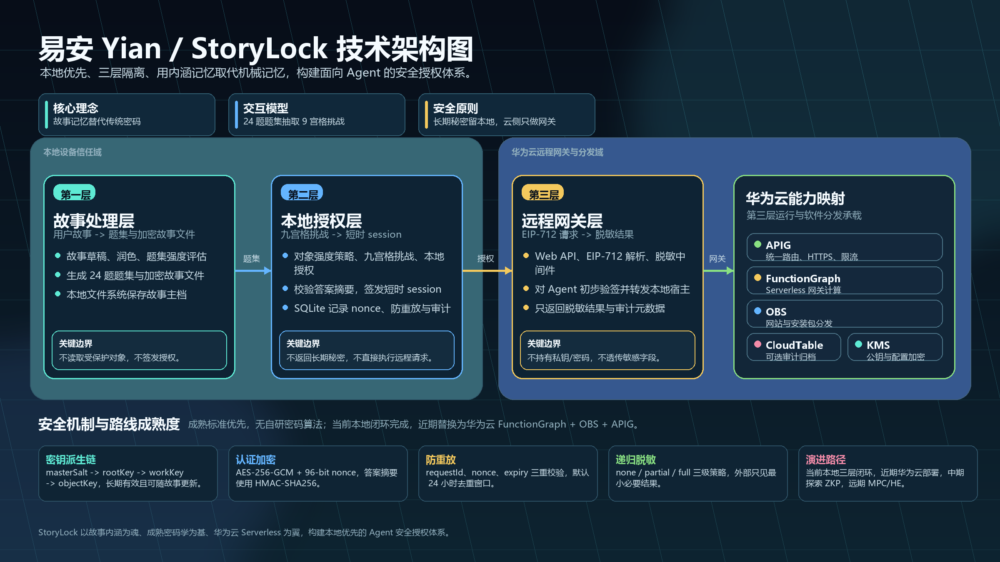

# 易安故事锁加密授权系统技术说明书

## 1. 项目概览

| 项目 | 内容 |
| --- | --- |
| 产品名称 | 易安故事锁加密授权系统 |
| 简称 | 易安系统 |
| 适用场景 | Agent 场景下的本地私钥管理、文件密钥管理、敏感对象授权控制和本地确认 |
| 产品定位 | 面向远端 Agent / 云服务的本地授权与敏感对象管理方案 |
| 主要入口 | `https://yian.cdao.online` |
| 核心组件 | 易安远程访问接口、易安 App / 私人智能助理、StoryLock 本地核心 |
| 代码根目录 | `skill/` |
| 文档版本 | 2026-06-18 |

## 2. 背景与摘要

数字化个人代理正在使传统的“用户亲自授权”转向“Agent 自主持有密钥”。这种变化提升了自动化效率，也迫使用户对运行 Agent 的服务器给予接近无保留的信任。对于强调用户自主管理资产、身份和权限的去中心化方向来说，这种信任集中化趋势是一个明显的技术倒退。

因此，需要一种技术手段，把签名授权、密码填充和敏感对象访问从中心化服务器侧拿回到用户可信的本地设备，同时保留 Agent 自动化协作带来的便利性。易安系统正是基于这一目标产生：远端 Agent 可以提出请求，私人智能助理可以解释请求，并根据对象安全等级进行分级管理，判断后续是否需要用户参与交互确认；StoryLock 本地核心负责敏感执行，用户始终在可信本地设备上完成关键确认。

StoryLock 是用于 Agent 场景的本地安全组件，负责私钥、文件密钥和敏感对象的授权管理。本地侧组件管理私钥、文件密钥和故事文件，远端 Agent 通过受控入口发起请求。文件内容由密钥保护，只有具备相应文件密钥、权限级别和本地确认结果的本地组件可以访问。StoryLock 将关联记忆线索引入授权判断，把“受权限控制的本地敏感对象访问”和“人能理解、能回忆的授权线索”封装为可复用的 Skill 能力。

一句话概括：

> 易安系统是一套面向 Agent 场景的本地授权能力包：本地设备管理私钥和文件密钥，关联记忆线索参与授权判断，三层 Skill 能力让远端 Agent 可以安全地使用本地能力。

## 3. 产品定位

易安是 StoryLock 使用流程中的远程访问接口与本地确认入口。它把来自外部 Agent、云服务或自动化流程的重要请求送达用户侧，由用户自己的本地设备完成解释、确认和敏感执行。

从产品定位上看，易安系统承担三类职责：

1. 远程访问接口
   对外提供下载、绑定、请求接入和请求状态查看能力。远端 Agent 或云服务通过这一入口发起受控请求，用户也通过这一入口查看当前请求状态。

2. 本地确认入口
   用户下载安装的易安 App 运行在自己的可信本地设备上，承载私人智能助理，并把需要确认的请求交给 StoryLock 本地核心处理。

3. 本地授权与密钥管理
   StoryLock 本地核心管理故事文件、文件密钥、私钥和敏感对象访问策略，并根据本地确认结果完成签名、密码填充或其他敏感执行。

因此，易安 App 是连接“易安远程访问接口”和“StoryLock 本地核心”的本地确认入口。日常使用时，用户通过易安远程访问接口完成下载和绑定；当远端发起密码填充、签名或其他交互授权请求时，用户在本地设备上查看请求状态并完成确认。



## 4. 运行结构

从软件运行结构上，系统分为三部分：

1. 易安远程访问接口
   部署在云服务平台上，负责提供说明入口、下载入口、绑定入口、请求入口和请求状态视图。外部 Agent 或服务通过受控接口发起请求，远程访问接口负责接收、记录、转发和展示状态。

2. 私人智能助理
   运行在用户可信的本地设备上，承载易安 App 的本地交互能力。它与易安远程访问接口保持双向通信，接收请求、解释来源和风险、展示待确认内容，并把需要敏感执行的部分交给 StoryLock 本地核心。

3. StoryLock 本地核心
   运行在本地设备侧，负责故事文件、密钥隔离、本地确认和敏感执行。它通过受控本地调用与私人智能助理协作，只把最小必要结果返回给私人智能助理。

整体请求路径如下：

```text
外部 Agent / 云服务 / pharos Agent / OpenClaw
  -> 易安远程访问接口
  <-> 私人智能助理
  <-> StoryLock 本地核心
```

远程访问接口负责云端入口与状态协调；私人智能助理负责用户侧解释、交互和转接；StoryLock 本地核心负责敏感材料和本地确认。

## 5. 三层 Skill 能力

项目在代码和 Skill 能力上组织为三层。运行结构说明请求在云端、本地助理和本地核心之间如何流转；能力分层说明代码能力如何拆分、复用和验证。

### 5.1 第一层：本地故事处理

第一层负责本地故事草稿、故事润色和题集强度评估。

| 项目 | 内容 |
| --- | --- |
| 代码包 | `src/storylock-local-story-processing-skill` |
| 主要能力 | 故事草稿生成、故事润色、题集强度评估 |
| 典型 Skill | `StoryDraftSkill`、`StoryRefineSkill`、`StrengthReviewSkill` |

这一层提供人与系统都能理解的故事和记忆线索材料，为后续授权判断提供可解释的上下文。

### 5.2 第二层：本地受控授权

第二层负责根据目标对象判断需要的授权强度，并生成对应的本地验证流程。

| 项目 | 内容 |
| --- | --- |
| 代码包 | `src/storylock-local-story-access-skill` |
| 主要能力 | 对象级强度策略、九宫格验证、本地授权、短时会话、防重放 |
| 典型 Skill | `ObjectStrengthPolicySkill`、`GridChallengeSkill`、`LocalAuthorizationSkill` |

这一层集中处理“能否访问某个敏感对象”“需要多高强度确认”“授权窗口持续多久”等问题。

### 5.3 第三层：远程网关与受控委托

第三层负责把外部 Agent 或云服务的调用包装成统一、可验证、可审计的请求。

| 项目 | 内容 |
| --- | --- |
| 代码包 | `src/storylock-remote-gateway-skill` |
| 主要接口 | `requestSignature`、`requestPasswordFill` |
| 主要能力 | 远程请求封装、签名确认请求包装、Web2 密码填充请求包装、EIP-712 最小签名请求结构、最小结果返回 |

这一层让远端 Agent 可以使用本地能力，同时让实际授权、签名、密码填充和敏感材料访问保持在本地确认链路中。

## 6. 代码结构

### 6.1 三包结构

| 包 | 目录 | 职责 |
| --- | --- | --- |
| `storylock-local-story-processing-skill` | `src/storylock-local-story-processing-skill` | 第一层，本地故事处理 |
| `storylock-local-story-access-skill` | `src/storylock-local-story-access-skill` | 第二层，本地受控授权 |
| `storylock-remote-gateway-skill` | `src/storylock-remote-gateway-skill` | 第三层，远程请求封装与网关 |

### 6.2 聚合与共享模块

| 模块 | 目录 | 说明 |
| --- | --- | --- |
| `storylock-skill-engine` | `src/storylock-skill-engine` | 统一导出、示例脚本、自测脚本和兼容演示入口 |
| `shared` | `src/shared` | 共享加密、SQLite 和 SecretStore 适配代码 |
| `yian-web` | `src/yian-web` | 易安远程访问接口的静态站点与帮助入口 |
| `android-host` | `android-host` | 易安 App / 私人智能助理 / StoryLock 本地核心演示闭环的 Android 工程 |

## 7. 核心机制

### 7.1 关联记忆线索

StoryLock 使用故事、提示和题集作为关联记忆线索，辅助用户完成可理解、可回忆的授权确认。它把授权确认从单纯机械输入，提升为“用户能理解请求、能回忆线索、能判断风险”的本地确认过程。

关联记忆线索在系统中承担三类作用：

1. 帮助用户理解敏感对象与授权请求之间的关系。
2. 为不同对象配置不同强度的本地确认方式。
3. 在长期使用中降低用户遗忘固定口令或机械凭据的风险。

故事处理层负责生成和整理线索，本地受控授权层负责根据对象策略选择确认强度，StoryLock 本地核心负责在本地执行敏感确认。

### 7.2 请求状态

请求状态是系统运行时的核心视图。一个请求通常经历以下状态：

1. 已创建：外部 Agent 或服务发起请求。
2. 已接收：易安远程访问接口收到请求。
3. 已送达：私人智能助理接收到请求。
4. 待确认：用户正在本地设备上查看请求。
5. 已确认或暂不确认：用户完成确认，或暂时保留不确认。
6. 已完成：结果被返回给私人智能助理，并按需要同步状态。

用户需要重点关注当前是否有请求等待处理、请求来源是否可信、请求内容是否与当前操作一致，以及是否需要在本地设备上确认。

### 7.3 本地确认

本地确认包含两个层次：

1. 用户确认
   用户查看来源、内容和风险，判断请求是否与当前操作一致。

2. 设备确认
   本地设备通过解锁、生物识别或设备凭据确认用户意图。

当用户确认和设备确认都满足要求时，请求继续进入 StoryLock 本地核心执行。

### 7.4 最小结果返回

StoryLock 本地核心完成敏感操作后，只把最小必要结果返回给私人智能助理。私人智能助理再根据请求需要同步确认状态给易安远程访问接口。

这种最小返回方式减少了远端系统接触敏感材料的机会，也让用户可以把关键判断和敏感执行保持在本地设备侧。

## 8. 安全机制

| 能力 | 说明 |
| --- | --- |
| 本地持有 | 私钥、文件密钥、故事文件和敏感材料由本地设备侧组件管理 |
| 对象级强度策略 | 根据目标对象决定所需确认强度 |
| 九宫格验证 | 根据确认强度生成本地验证挑战 |
| 防重放 | 使用 `requestId`、`nonce` 和过期时间约束重复提交和过期请求 |
| 短时会话 | 通过短时会话控制授权窗口 |
| 自动锁定与恢复 | 连续失败后进入锁定窗口，锁定窗口结束后恢复可用 |
| 对象加密 | 使用加密机制保护本地对象内容 |
| 密钥派生 | 使用派生机制生成使用密钥 |
| 答案摘要 | 使用摘要保存验证答案，避免明文保存 |

这些机制共同保证远端请求可以被处理，本地确认权和敏感材料控制权保留在用户可信设备侧。

## 9. 安装与校验

易安 App 下载安装前应核对版本号、文件大小和 SHA-256 校验值。校验值用于确认安装包在传输和分发过程中保持一致。

安装包信息由易安远程访问接口统一展示，包括版本号、文件大小、发布类型和 SHA-256 校验值。用户下载安装包时，应以接口展示的最新信息为准；安装前完成一次核对，确认下载文件与远程访问接口展示的信息一致。

安装包校验流程建议如下：

1. 从易安远程访问接口进入下载入口。
2. 记录页面展示的版本号、文件大小和 SHA-256。
3. 下载完成后，对本地文件计算 SHA-256。
4. 对比本地文件大小和 SHA-256 是否与页面展示一致。
5. 信息一致后再继续安装。

发布正式安装包时，应同步更新远程访问接口中的版本号、文件大小、发布类型和 SHA-256，确保用户看到的信息与实际分发文件保持一致。

## 10. 典型应用场景

| 场景 | StoryLock 的作用 |
| --- | --- |
| Web2 密码填充 | 远端 Agent 发起请求，用户在本地设备确认目标站点和请求来源，StoryLock 本地核心完成本地授权 |
| 签名确认 | 外部 Agent、pharos Agent 或 OpenClaw 通过 Skill 发起签名确认请求，本地核心返回最小必要结果 |
| 故事文件与敏感对象访问 | 根据目标对象执行强度策略，生成本地验证流程，并在确认后返回授权结果 |
| 多账号与多对象协作 | 为不同账号、凭据对象和本地文件配置不同确认强度，让远端自动化流程在受控范围内使用本地能力 |

## 11. 总结

易安系统可以概括为一套面向 Agent 场景的本地授权和敏感对象管理方案。易安远程访问接口负责请求接入、绑定、下载和状态展示；私人智能助理负责用户侧解释、交互和转接；StoryLock 本地核心负责故事文件、密钥隔离、本地确认和敏感执行。

这套方案的核心价值包括：

1. 把远端请求带回用户可信本地设备确认。
2. 用三层 Skill 能力拆分故事处理、本地受控授权和远程委托入口。
3. 用关联记忆线索辅助用户完成可理解、可回忆的授权判断。
4. 用对象级强度策略、九宫格验证、防重放、短时会话和最小返回原则控制敏感对象访问。
5. 让远端 Agent 可以使用本地能力，同时保留用户在本地设备上的最终确认权。
